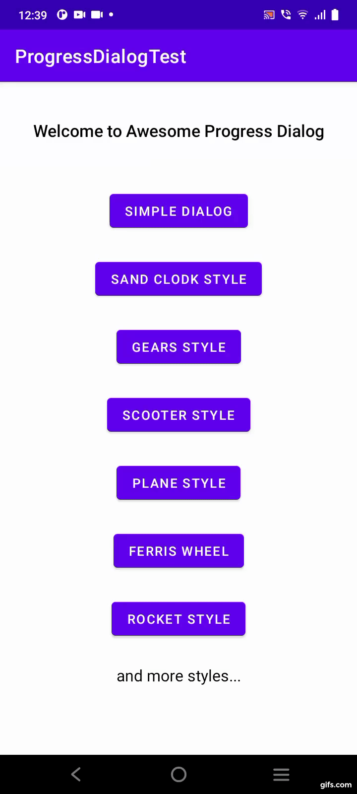
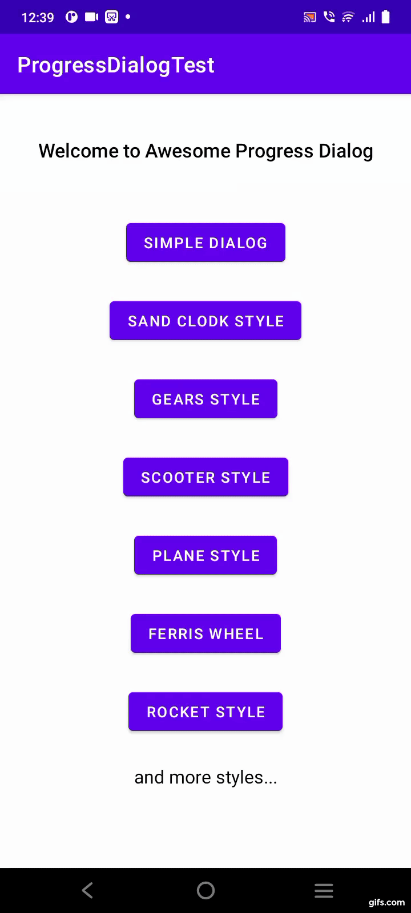
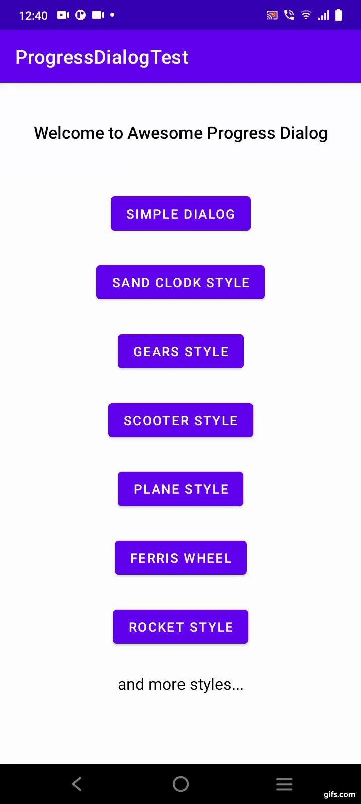

# Awesome Progress Dialog 📱

[](https://jitpack.io/#Abhay-cloud/AwesomeProgressDialog-Android)


An animated progress dialog library for Android.

<table style="width:50%">
  <tr>
    <th><b>1. Style Loading Gears<b></b></th>
    <th>2. Style Loading SandClocK</th> 
    <th>3. Style Loading Rocket</th>
  </tr>
  <tr>
    <td></td>
    <td></td> 
    <td></td>
  </tr>
</table>

# Site Map
>- [Introduction](#introduction)
>- [Various Dialog](#Various)
>- [Implementation](#Implementation)
>- [Usage](#Usage)
>- [Use Different Styles](#styles)
>- [Methods](#methods)
>- [Contribute](#contribution)
>- [Credits](#credits)

<a name="introduction"></a>
## Introduction
**Awesome Progress Dialog** is an  animated progress dialog library for Android 
which is built by using beautiful [**Lottie**](https://github.com/airbnb/lottie-android) animations.
This library will be useful to create animated, rich, beautiful progress dialogs in Android apps easily.

<a name="Various"></a>
## Various dialogs
We offer various styles of progress dialog i.e. Simple Progress Dialog, 
Loading Gears Dialog, Loading Sandclock Dialog, Loading Ferris Wheel dialog, etc.
To get all styles refer [Different Styles of progress dialog](#styles).

<a name="Implementation"></a>
## Implementation
### Step 1. Add the JitPack repository to your build file

Add it in your root build.gradle at the end of repositories:
```groovy
allprojects {
		repositories {
			...
			maven { url 'https://jitpack.io' }
		}
	}
```        
### Step 2. Add the dependency
```groovy
dependencies {
	        implementation 'com.github.Abhay-cloud:AwesomeProgressDialog-Android:0.1'
	}
```
<a name="Usage"></a>
## Usage
Java:
```groovy
AwesomeProgressDialog progressDialog = new AwesomeProgressDialog(Context);
progressDialog.addTitle("Loading..."); // add your title here. 
// By default title is "Loading".
progressDialog.setStyle(AwesomeProgressDialog.STYLE_LOADING_SIMPLE);
// By default style is SIMPLE Loading style
// you can change it 
progressDialog.showDialog();
```
<a name="styles"></a>
## Set Different Styles 
You can change style of dialog by using .setStyle method:
```groovy 
progressDialog.setStyle(AwesomeProgressDialog.STYLE_LOADING_FERRISWHEEL);
```
Current available styles:
>- STYLE_LOADING_SIMPLE
>- STYLE_LOADING_DOTS
>- STYLE_LOADING_TILES
>- STYLE_LOADING_GEARS
>- STYLE_LOADING_PLANE
>- STYLE_LOADING_ROCKET
>- STYLE_LOADING_FERRISWHEEL
>- STYLE_LOADING_SANDCLOCK
>- STYLE_LOADING_SCOOTER 
>- STYLE_LOADING_DELIVERY
>- STYLE_LOADING_CART
>- STYLE_LOADING_WHEEL
>- STYLE_LOADING_EARTH
>- STYLE_LOADING_SPIDER
>- STYLE_LOADING_BARS
>- STYLE_LOADING_CIRCLE
>- STYLE_LOADING_CIRCLE2

<a name="methods"></a>
## Methods
>- .addTitle(String title);
```Groovy
progressDialog.addTitle("Loading...");
```
>- .hideTitle();
```Groovy
progressDialog.hideTitle();
```
>- .isCancelable(boolean val);
```Groovy
progressDialog.isCancelable(false);
```
>- .showDialog();
```Groovy
progressDialog.showDialog();
```
>- .setStyle(String style);
```groovy 
progressDialog.setStyle(AwesomeProgressDialog.STYLE_LOADING_FERRISWHEEL);
```

>- .dismissDialog();
```Groovy
progressDialog.dismissDialog();
```

>- .setNoInternet(String title);
*This method don't detect connection change. 
You'll have to call it in your custom internet detection code.*
```Groovy
progressDialog.setNoInternet("Connection Lost");
```
<a name="contribution"></a>
## Contributing

Contributions are always welcome!

Let's develop with collaborations. We would love to have contributions by raising issues.


<a name="credits"></a>

## Credits
This library is built by using:.
- [Lottie for Android](https://github.com/airbnb/lottie-android)
- [Lottie Files](https://lottiefiles.com/)

## LICENSE
Project is published under the Apache 2.0 license. Feel free to clone and modify repository as you want, but don't forget to add reference to authors.

## Connect with me
If you have any difficulty then just message me on Instagram or Telegram.

[](https://twitter.com/Abhay_Developer)
[](https://www.instagram.com/its_sn_abhay/)
[](https://t.me/abhaycloud)


### Made with ❤️ by Abhay
